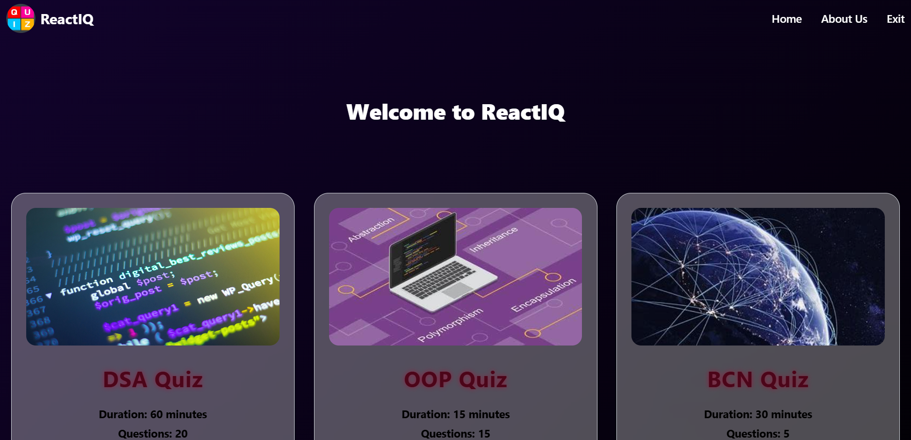

# 🎉 React Quiz App 🎉

## 🚀 Introduction
Welcome to the **React Quiz App**, your go-to platform for testing your knowledge across various topics! Built with the latest technologies, this app offers an engaging and interactive quiz experience that adapts to your learning style. 

### 🌟 **Key Features**
- **Dynamic Quiz Selection**: Choose from multiple quizzes displayed as interactive cards.
- **Real-time Data Loading**: Fetch quiz questions from an API using Axios.
- **Smooth Navigation**: Experience seamless routing between the home page and quiz pages.
- **Auto Submission**: Quizzes are automatically submitted once the time limit is reached.
- **Comprehensive Results Summary**: Get insights into correct, incorrect, and unattempted questions.
- **User-Friendly Design**: Styled with Tailwind CSS for a responsive and attractive UI.

 <!-- Replace with an actual demo image -->

## 🛠️ Technologies Used
- **React**: The leading library for building user interfaces.
- **Vite**: A modern, fast build tool that offers a great development experience.
- **Tailwind CSS**: A utility-first CSS framework for rapid styling.
- **Axios**: A promise-based HTTP client for making API requests.

## 📚 Learning Journey
Throughout this project, I have enhanced my skills in:
- **React**: Mastered component-based architecture and state management.
- **Tailwind CSS**: Developed responsive designs using utility classes.
- **API Integration**: Gained experience in fetching data from APIs with Axios.

## 🚧 Future Plans
- **Backend Integration**: Plan to incorporate MongoDB for user management and storing quiz results.
- **Enhanced User Experience**: Aim to refine routing and improve overall app performance.

## 🔧 Getting Started
To set up the project locally, follow these steps:

## 💡 How to Use
1. **Select a Quiz**:  
   Browse the quiz cards on the main page to view available quizzes.

2. **Start the Quiz**:  
   Click on a quiz card to begin your quiz journey.

3. **Answer the Questions**:  
   Respond to the quiz questions within the time limit provided.

4. **Automatic Submission**:  
   Your quiz will be automatically submitted once the time is up.

5. **Review Your Results**:  
   After submission, check your performance on the results summary page, which displays correct, incorrect, and unattempted questions.

🎯 Purpose
This project was created to enhance my front-end development skills using React and Tailwind CSS, with a focus on creating an interactive user experience.

📄 License
This project is licensed under the MIT License. See the LICENSE file for details.

